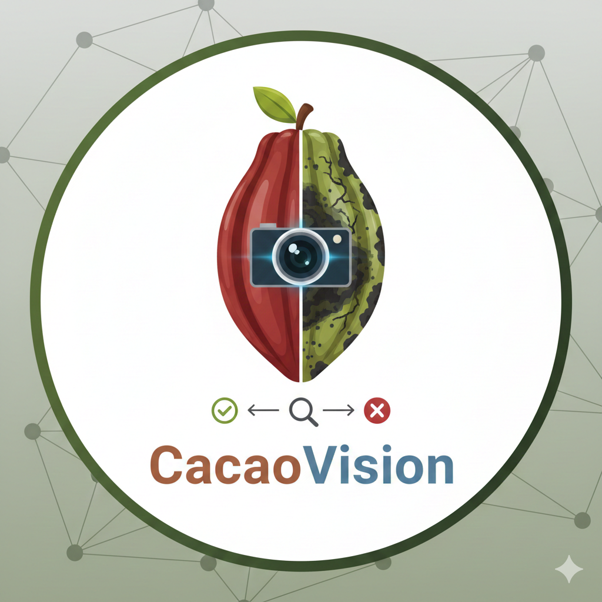

# CacaoVision

<p align="center">
  
</p>

<p align="center">
  <strong>Deteccion de enfermedades en mazorcas de cacao mediante inferencia YOLO en dispositivo</strong>
</p>

<p align="center">
  
  
  
  
  
</p>

---

## Descripcion

CacaoVision es una aplicacion movil multiplataforma (iOS/Android) desarrollada como Trabajo Fin de Master (TFM) en la **Universidad Internacional de Valencia (VIU)** dentro del Master en Inteligencia Artificial. La app permite detectar enfermedades en mazorcas de cacao directamente en el dispositivo, sin necesidad de conexion a internet, utilizando modelos YOLO exportados a formato ONNX.

### Enfermedades detectadas

| Clase | Nombre | Descripcion |
|-------|--------|-------------|
| Saludable | `healthy` | Mazorca de cacao en estado saludable |
| Moniliasis | `moniliasis` | Pudricion helada causada por *Moniliophthora roreri* |
| Mazorca Negra | `black_pod` | Mazorca negra causada por *Phytophthora palmivora* |

---

## Stack tecnologico

| Tecnologia | Version | Proposito |
|------------|---------|-----------|
| Expo SDK | 54 | Framework de desarrollo movil |
| React Native | 0.81 | UI nativa multiplataforma |
| TypeScript | 5.9 | Tipado estatico |
| ONNX Runtime RN | 1.24 | Inferencia de modelos en dispositivo |
| Expo Router | 6.0 | Navegacion basada en archivos |
| Tailwind CSS | 4.1 | Estilos utilitarios (via react-native-css) |
| EAS Build | - | Compilacion nativa en la nube |

---

## Arquitectura

### Estructura del proyecto

```
cacaoVision/
├── app/                          # Pantallas (Expo Router)
│   ├── _layout.tsx              # Layout raiz (Stack)
│   ├── (tabs)/
│   │   ├── _layout.tsx          # Layout de pestanas
│   │   ├── index.tsx            # Pantalla principal
│   │   └── about.tsx            # Pantalla "Acerca de"
│   └── detection.tsx            # Pantalla de resultados (modal)
│
├── src/
│   ├── components/              # Componentes reutilizables
│   │   ├── DetectionOverlay.tsx # Cuadros delimitadores sobre imagen
│   │   ├── DetectionMetrics.tsx # Metricas y desglose de detecciones
│   │   ├── ImageSourceSheet.tsx # Bottom sheet camara/galeria
│   │   ├── ModelSelector.tsx    # Importacion y tipo de modelo
│   │   ├── ModelStatusBadge.tsx # Indicador estado del modelo
│   │   └── EmptyState.tsx       # Estado sin modelo cargado
│   │
│   ├── inference/               # Pipeline de inferencia ONNX
│   │   ├── modelService.ts     # Orquestador principal
│   │   ├── modelDetector.ts    # Auto-deteccion del tipo de modelo
│   │   ├── postprocessing.ts   # Postprocesado YOLO26n
│   │   ├── postprocessingYolo11n.ts # Postprocesado YOLO11n + NMS
│   │   └── imageUtils.ts       # Preprocesado + decodificador PNG
│   │
│   ├── hooks/                   # Hooks personalizados
│   │   ├── useModel.ts         # Carga/descarga + persistencia
│   │   ├── useDetection.ts     # Orquestacion de inferencia
│   │   └── useImagePicker.ts   # Permisos y selector de imagen
│   │
│   ├── constants/               # Constantes de la app
│   │   ├── colors.ts           # Paleta de colores cacao
│   │   ├── classes.ts          # Clases de enfermedades
│   │   └── models.ts           # Parametros del modelo
│   │
│   └── types/                   # Interfaces TypeScript
│       ├── detection.ts        # Detection, ModelInfo, BoundingBox
│       └── navigation.ts       # Tipos de rutas
│
├── assets/images/               # Iconos y splash
├── app.json                     # Configuracion Expo
├── eas.json                     # Configuracion EAS Build
├── tailwind.config.ts           # Tailwind v4 + colores cacao
├── metro.config.js              # Metro bundler (.onnx support)
└── withOnnxruntimeFix.js        # Plugin para fix ONNX Runtime
```

### Pipeline de inferencia

```
Imagen (URI)
    │
    ▼
preprocessImage()
    │  Redimensionar a 640×640
    │  Extraer pixeles RGBA (decodificador PNG custom)
    │  Convertir a CHW float32 normalizado [0,1]
    │
    ▼
ONNX Runtime Session.run()
    │
    ▼
Auto-deteccion por forma del tensor de salida
    │
    ├─ YOLO26n [1,300,6] ──► postprocessing.ts
    │     NMS integrado en modelo
    │     Filtrar por confianza > 0.25
    │
    └─ YOLO11n [1,7,8400] ──► postprocessingYolo11n.ts
          Extraer anchors + scores
          Filtrar por confianza > 0.25
          Aplicar NMS (IoU > 0.45)
    │
    ▼
DetectionResult { detections[], processingTimeMs, imageUri, modelType }
```

---

## Decisiones tecnicas clave

### 1. Decodificador PNG personalizado
React Native no tiene Canvas API nativo. Se implemento un decodificador PNG completo en TypeScript (`imageUtils.ts`) que incluye descompresion zlib DEFLATE y reconstruccion de todos los filtros PNG (Sub, Up, Average, Paeth). Buffer pre-asignado de 2MB para rendimiento.

### 2. Auto-deteccion del tipo de modelo
En lugar de requerir que el usuario especifique el tipo de modelo, `modelDetector.ts` ejecuta una inferencia dummy con entrada cero e inspecciona la forma del tensor de salida para distinguir automaticamente entre YOLO26n y YOLO11n. Si falla, el usuario puede seleccionar manualmente.

### 3. ONNX Runtime con carga lazy
El modulo nativo de ONNX Runtime se importa dentro de funciones (no a nivel de modulo) para evitar crashes en Expo Go. Solo funciona en dev builds y production builds.

### 4. Plugin personalizado para ONNX Runtime
`withOnnxruntimeFix.js` resuelve dos problemas criticos:
- Conflicto de `libreactnative.so` duplicado en Android (agrega `pickFirst`)
- Falta de auto-linking de `OnnxruntimePackage` (lo registra manualmente en `MainApplication.kt`)

### 5. Tailwind CSS v4 con react-native-css
Se eligio `react-native-css` sobre NativeWind por compatibilidad con Tailwind v4. Requiere `--legacy-peer-deps` por conflicto de peer dependencies con `react-native-css-interop`.

### 6. Persistencia del modelo
El ultimo modelo cargado se guarda en AsyncStorage y se recarga automaticamente al abrir la app, evitando que el usuario tenga que importarlo cada vez.

---

## Modelos soportados

| Modelo | Tamano | Salida | NMS | Descripcion |
|--------|--------|--------|-----|-------------|
| YOLO26n | ~9.35 MB | [1, 300, 6] | Integrado | End-to-end, incluye NMS en el modelo |
| YOLO11n | ~10.11 MB | [1, 7, 8400] | En app | Salida raw de anchors, NMS implementado en la app |

**Parametros de inferencia:**
- Tamano de entrada: 640 x 640 px
- Umbral de confianza: 0.25
- Umbral IoU (NMS): 0.45
- Clases: 3 (healthy, moniliasis, black_pod)

---

## Guia de ejecucion local

### Prerrequisitos

- **Node.js** >= 18
- **npm** >= 9
- **EAS CLI**: `npm install -g eas-cli`
- **Cuenta de Expo**: [expo.dev](https://expo.dev) (necesaria para EAS Build)
- **Android Studio** con SDK 34+ (para builds locales de Android)
- **Xcode** 15+ (solo para iOS en macOS)

### 1. Clonar el repositorio

```bash
git clone https://github.com/luissanchez/cacaovision.git
cd cacaovision
```

### 2. Instalar dependencias

```bash
npm install --legacy-peer-deps
```

> **Nota:** El flag `--legacy-peer-deps` es necesario por el conflicto de peer dependencies entre Tailwind CSS v4 y react-native-css-interop.

### 3. Configurar EAS

```bash
eas login
eas build:configure
```

### 4. Crear un dev build (Android)

La app usa modulos nativos (ONNX Runtime, camara) y **no puede ejecutarse en Expo Go**. Es necesario crear un build de desarrollo:

```bash
# Build de desarrollo para Android (APK)
npx eas build --platform android --profile development

# O build local (requiere Android Studio configurado)
npx expo run:android
```

### 5. Crear un dev build (iOS)

```bash
# Build para simulador iOS
npx eas build --platform ios --profile development

# O build local (requiere Xcode)
npx expo run:ios
```

### 6. Ejecutar el servidor de desarrollo

```bash
npx expo start
```

Escanear el codigo QR con la app de desarrollo instalada en el dispositivo.

### 7. Cargar un modelo ONNX

1. Abrir la app en el dispositivo
2. Pulsar **"Importar Modelo"** en la pantalla principal
3. Seleccionar un archivo `.onnx` (YOLO26n o YOLO11n entrenado para cacao)
4. La app detectara automaticamente el tipo de modelo
5. El modelo se persiste para futuras sesiones

---

## Build de produccion (APK)

### Generar APK via EAS Build

```bash
# Build de produccion para Android
npx eas build --platform android --profile production
```

El APK estara disponible para descarga en el dashboard de [expo.dev](https://expo.dev) una vez finalice el build.

### Perfiles de build disponibles

| Perfil | Plataforma | Tipo | Uso |
|--------|-----------|------|-----|
| `development` | Android | APK | Dev client con hot reload |
| `development` | iOS | Simulator | Dev client para simulador |
| `preview` | Android | APK | Distribucion interna de pruebas |
| `production` | Android | APK | Build final de produccion |

---

## Resultados

La app realiza inferencia completamente en el dispositivo con los siguientes tiempos aproximados:

| Fase | Tiempo |
|------|--------|
| Preprocesado de imagen | ~200-300 ms |
| Inferencia YOLO26n | ~100-300 ms |
| Inferencia YOLO11n | ~150-350 ms |
| **Total** | **~300-650 ms** |

> Los tiempos varian segun el dispositivo. Medidos en dispositivos Android de gama media.

### Funcionalidades principales

- Deteccion en tiempo real sin conexion a internet
- Soporte para camara y galeria de imagenes
- Visualizacion de cuadros delimitadores con colores por clase
- Metricas detalladas: total de detecciones, tiempo de procesamiento, desglose por clase
- Captura y guardado de resultados con anotaciones en galeria
- Persistencia automatica del modelo cargado
- Interfaz completamente en espanol

---

## Permisos

| Permiso | Plataforma | Uso |
|---------|-----------|-----|
| Camara | iOS/Android | Captura de fotos para deteccion |
| Galeria de fotos | iOS/Android | Seleccion de imagenes existentes |
| Almacenamiento | Android | Guardar resultados anotados |

---

## Autor

**Luis Sanchez**
Master en Inteligencia Artificial - Universidad Internacional de Valencia (VIU)
Trabajo Fin de Master (TFM) - 2025

---

## Licencia

Este proyecto esta bajo la licencia MIT. Consultar el archivo [LICENSE](./LICENSE) para mas detalles.
